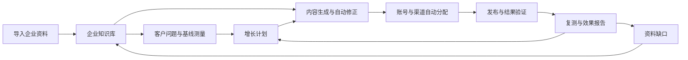
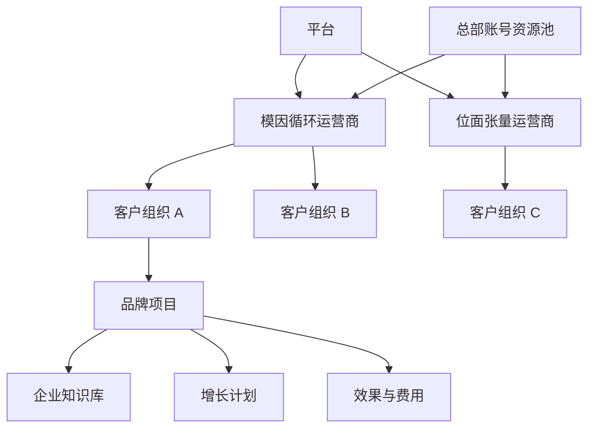
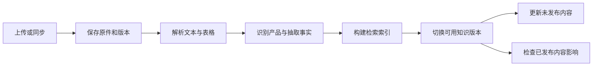
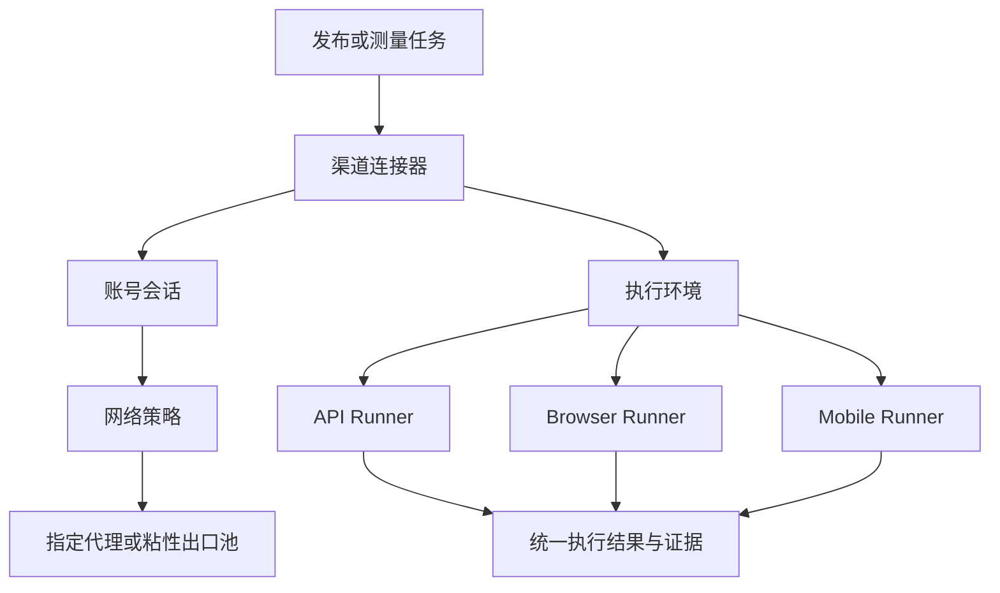
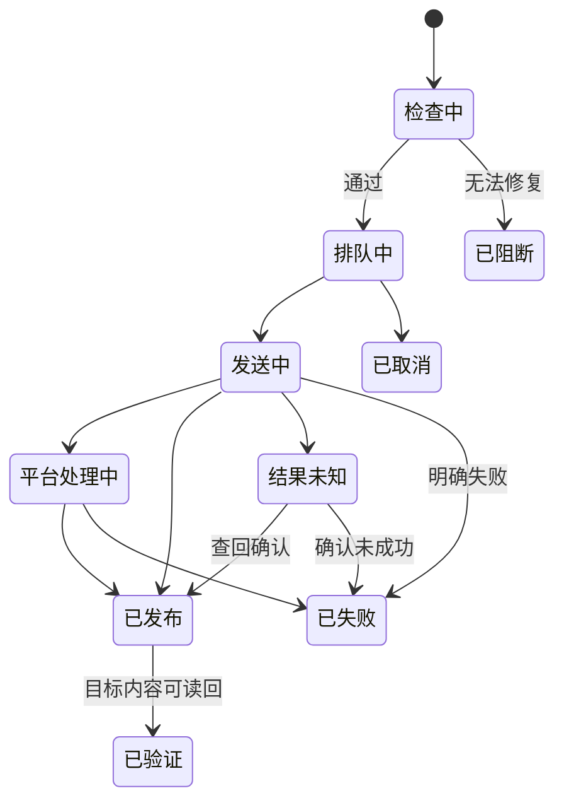
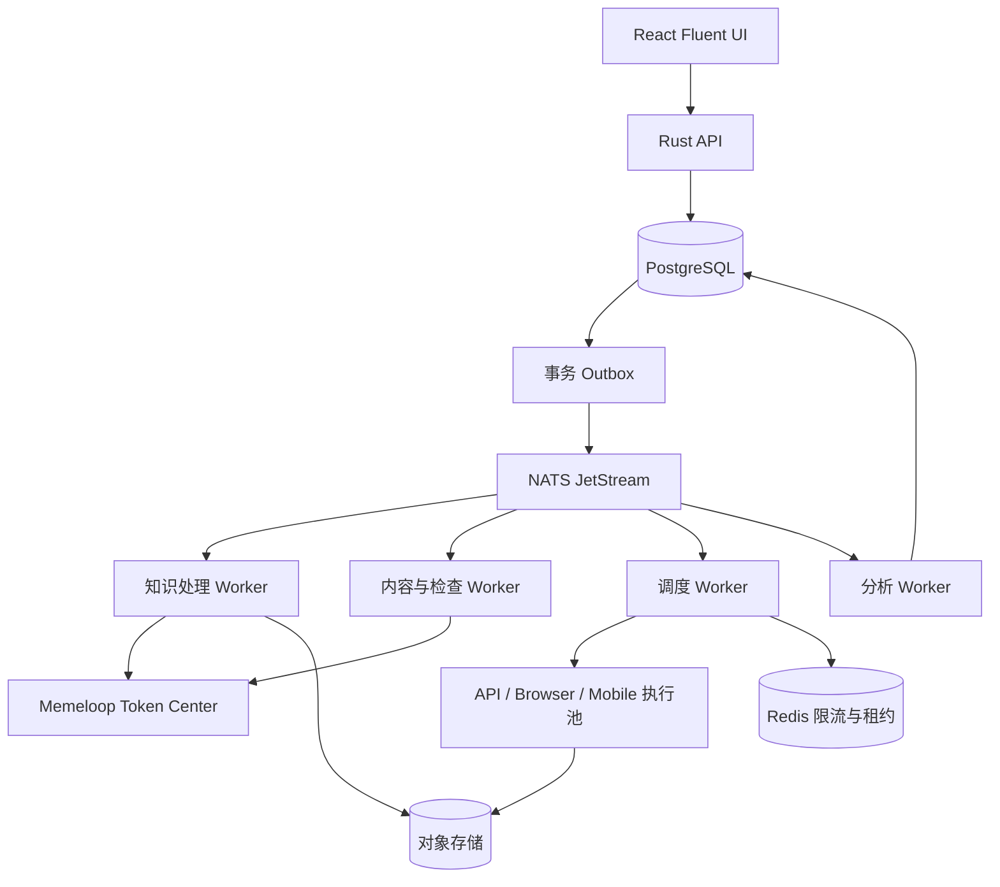

# Memeloop GEO 产品与开发规格书

版本：1.0  
产品形态：多租户 SaaS、自动化托管、企业定制、OEM 白标

技术栈：TypeScript / React / Fluent UI；Rust

首发运营商：模因循环、位面张量

冻结日期：2026-09-18  
状态：实施基线。本次按用户提供的完整规格恢复主体并纳入“两层 fan-out → reduce → 下一轮”架构；此后需求、进度和实施记录写入 TODO.md 与 WORKLOG.md，不再直接改写冻结基线。

---

## 1. 产品定义与交付范围

### 1.1 产品价值

Memeloop GEO 将企业资料转化为可持续生产、分发和验证的内容资产，帮助客户回答三个问题：

1. 潜在客户询问 AI 时，为什么没有出现我们的品牌或产品？
2. 应补充哪些资料、内容和公开信源，系统能否自动完成？
3. 已经做了什么、花了多少钱、被哪些 AI 答案引用、是否产生询盘？

产品主流程：



### 1.2 首版完整交付

首版包含：

- 企业知识库：资料导入、结构化产品知识、检索问答、来源定位、增量更新。
- GEO 诊断：问题集、基线采样、竞品与信源差距、站点检查。
- 增长计划：选题、内容生产、渠道适配、自动排期、预算控制。
- 内容工作台：文章、FAQ、对比内容、素材、版本、发布记录。
- 账号与资源：批量接入、登录态管理、总部资源池、独立网络出口。
- 自动发布：API、网页执行框架，结果查回和失败恢复。
- 效果分析：原始样本、提及与引用、周期对比、发布资产关联。
- 商业能力：套餐、资源包、预算、订单、成本与 OEM。
- 移动扩展基础：统一设备接口、已有 Appium 设备池接入及模拟测试。

具体云手机供应商的设备创建、租赁和计费接口属于后续适配，不阻塞网页与 API 的完整闭环。

### 1.3 默认运行原则

- 生产和发布没有人工审批节点。
- 用户一次启动后，系统按计划和预算自动运行。
- 用户随时可以修改资料、编辑内容、调整计划或暂停。
- 自动检查失败只停止相关内容或渠道，不无条件停止整个项目。
- 不要求员工提交账号用途声明、认领任务或逐篇确认。
- 账号来源只作为可选备注，不决定接入流程。
- 渠道不可用时明确显示缺失能力，不用另一种渠道冒充成功。
- UI 中不使用未经解释的综合“GEO 分数”代替实际成果。

### 1.4 两层 fan-out 与 reduce 的主架构

上面的主流程是业务概览，实际编排按以下三个阶段运行，不能实现为“生成一篇文章、选一个渠道发布、结束”。


- 第一阶段以企业资料为起点，按项目的产品、市场、语言、问题簇和内容类型形成有限、版本化的文档覆盖清单；对清单中的每份文档并行执行简报、检索证据、生成和自动检查/修复。输出是可复用、可溯源的主知识文档，不是针对单一平台的一次性文案。
- “全部可分发知识文档”指当前资料与项目范围支持的全部清单项，不指无限枚举问题或无限生成同义文章。资料不足、内部用途、冲突、预算不足的项仍记录在清单中并说明原因；不能静默删掉未完成项后宣称全覆盖。
- 第二阶段以第一阶段已通过检查的文档版本集合为输入，展开到项目范围内全部可发布平台。每个“文档 × 平台”都有覆盖记录，按平台能力生成/复用渠道变体，再按资源、账号、出口、预算与频控调度。默认每个平台选择一个适合的目标账号；多账号复制仅在计划明确要求时展开，不默认向账号池全部账号重复发送。
- “全部可发布平台”以本轮冻结的平台能力与项目资源范围为准：已实测支持、项目启用且具有相应发布权限；暂时掉线、额度不足和不支持某种内容分别记录为延后、资源缺口或不适用。未适配的平台显示能力缺失，不冒充已经分发；新接入平台进入新清单版本。
- reduce 汇聚清单内所有平台的发布回执、公开读回证据和 AI 渠道测量结果，包括失败、未知、缺测及不适用项。发布平台集合与 AI 测量渠道集合分别建模，不能用“文章发布成功”替代“AI 引用有效”，也不能把跨平台汇聚理解为混算指标。
- reduce 对重复证据做收敛去重，对问题簇与内容效果做归纳，对事实错误、旧内容、覆盖缺口、异常变化与资源根因做检测，形成每周报告和下一轮增量动作。发布与引用之间只报告可追溯关联，不无依据宣称因果提升。
- 各阶段无人审批；分支失败只影响其依赖项。阶段完成表示清单项均有明确处理结果，不要求全部成功；预算和策略约束始终优先，不能为达成“全部”绕过限制。

沿用独立实现、同一产品版本支持多运营商的约束，不复制参考项目代码。服务端从身份推导租户与运营商权限，配合数据库 RLS；公共资源仅以受限引用参与调度，不开放客户知识。

---

## 2. 用户、工作区与导航

### 2.1 组织结构



企业知识库属于客户组织。项目选择可使用的知识集合，并按产品、市场和语言过滤。一个客户的多个项目可以复用资料，不需要重复上传。

总部账号资源可以供多个客户使用，但客户的知识、内容、费用和测量样本保持隔离。

### 2.2 用户角色

| 角色 | 主要能力 |
|---|---|
| 客户管理员 | 管理项目、资料、成员、账号、预算和订阅 |
| 客户成员 | 维护资料、查看与编辑内容、查看报告 |
| 客户只读成员 | 查看已允许的项目和报告 |
| 运营人员 | 在被分配的客户范围内维护资料、策略和资源 |
| 资源管理员 | 管理账号、出口、连接器、资源包及容量 |
| OEM 管理员 | 管理本运营商品牌、客户、套餐和经营数据 |

这是软件访问权限，不产生额外审批流程。

### 2.3 客户端导航与路由

项目路径统一以 `/app/:tenantId/:projectId` 为前缀。

| 编号 | 页面 | 路由后缀 | 默认落点 |
|---|---|---|---|
| P01 | 项目启动 | `/setup` | 未完成启动的步骤 |
| P02 | 项目总览 | `/overview` | 最近 30 天 |
| P03 | 企业知识库 | `/knowledge` | 产品与事实 |
| P04 | 资料详情 | `/knowledge/sources/:id` | 原文与处理结果 |
| P05 | 知识问答 | `/knowledge/ask` | 当前项目资料范围 |
| P06 | 增长计划 | `/campaigns` | 运行中的计划 |
| P07 | 计划详情 | `/campaigns/:id` | 本轮执行 |
| P08 | 内容资产 | `/content` | 最近更新 |
| P09 | 内容编辑 | `/content/:id` | 最新版本 |
| P10 | 账号与资源 | `/channels` | 已接入渠道 |
| P11 | 账号接入 | `/channels/connect` | 接入方式选择 |
| P12 | 发布记录 | `/publications` | 最近 7 天 |
| P13 | 效果分析 | `/measurement` | 最新完整测量周期 |
| P14 | 报告 | `/reports` | 已生成报告 |
| P15 | 费用 | `/billing` | 当前账期 |
| P16 | 项目设置 | `/settings` | 基本信息 |

总部管理区使用 `/ops`：

- 客户项目；
- 账号资源；
- 发布服务目录；
- 网络出口；
- 执行环境；
- 连接器；
- 经营数据。

OEM 管理区使用 `/operator`：

- 品牌与域名；
- 客户；
- 套餐与定价；
- 资源目录；
- 账单与收入；
- 成员与通知。

---

## 3. 前端设计系统

### 3.1 应用框架

基准设计尺寸为 1440 × 960，支持 1280 宽桌面完整操作。

- 顶栏：56px。
- 左侧导航：224px，可折叠为 64px。
- 页面内边距：24px。
- 内容区采用 8px 间距系统。
- 主标题：24px；分区标题：18px；正文：14px。
- 表格标准行高：44px；紧凑模式：36px。
- 普通详情侧栏：420px。
- 内容编辑与知识原文采用完整页面，不塞进小弹窗。
- 小于 1100px 时三栏变两栏，证据放入侧栏。
- 小于 768px 时单栏显示，保留查看、暂停和重新连接；复杂批量映射使用全屏步骤页。

Fluent UI v9 提供表格、标签页、输入、菜单、对话框、侧栏、通知和状态组件。步骤条使用统一封装组件，不依赖某个未经确认存在的组件名称。

### 3.2 共用交互

- 页面主操作置于标题右侧。
- 搜索和筛选保存在 URL，返回列表时恢复位置。
- 列表默认每页 50 条，支持服务器分页和批量选择。
- 详情页均有可直接访问的 URL。
- 长任务返回后台运行状态，离开页面后继续。
- 表格行点击打开详情；复选框只选择，不触发跳转。
- 停用、暂停立即生效；删除使用软删除并说明影响。
- “已提交任务”与“执行成功”使用不同提示。
- SSE 更新运行状态；断线后以最后事件 ID 恢复，必要时轮询。
- 页面不能因单个子任务失败显示全屏错误。

### 3.3 统一状态文案

| 状态 | 界面表现 |
|---|---|
| 空态 | 一句说明、一个主要入口，不展示全零假数据 |
| 首次加载 | 对应布局的 Skeleton |
| 后台更新 | 保留旧数据，显示“正在更新”及更新时间 |
| 部分成功 | 显示成功项和失败项数量，可只重试失败项 |
| 暂时不可用 | 原因、下次自动尝试时间 |
| 需要重新登录 | 账号级“重新连接”入口 |
| 被阻断 | 具体内容、原因及自动修复结果 |
| 结果未知 | “正在核对，系统不会重复发布” |
| 数据不足 | 显示样本量，不显示误导性趋势箭头 |

### 3.4 两层展开与汇聚的状态展示

运行级状态为：准备清单、文档生成中、平台分发中、等待观察窗口、汇聚分析中、周报已生成、下一轮已排期、已暂停。文档、平台、测量分支保留自己的状态，不以一个全局成功标签覆盖子项。

- 文档计数展示“清单总数、已就绪、生成中、资料不足、已阻断、预算延后、已取消”；平台矩阵展示“目标总数、待适配、排队、发送中、结果未知、已发布、已验证、明确失败、延后、不适用”。
- reduce 展示“预期输入、已收集输入、待核对、缺测、截止时间、快照版本”；发布证据与有效 AI 样本分别计数。
- 分母来自冻结清单，不随成功数反向变更；调整清单展示版本差异。暂停不停止在途结果查回与费用对账，已收集证据保留。
- 所有计数可进入对应失败项、原始证据或覆盖列表；页面不新增审批、认领和人工放行状态。

---

## 4. P01：首次启动完整流程

### 4.1 步骤


用户没有资料时可保存草稿；有官网即可启动资料抓取，不要求先建立分类。

### 4.2 页面线框

```text
┌──────────────────────────────────────────────────────────────────┐
│ Memeloop GEO                                      保存并稍后继续 │
├──────────────────────────────────────────────────────────────────┤
│ 创建品牌项目                                                     │
│ ① 品牌与资料 ───── ② 目标与市场 ───── ③ 资源与预算                │
│                                                                  │
│ 品牌名称 *  [____________________________]                        │
│ 官网地址    [https://____________________]                        │
│                                                                  │
│ ┌──────────────────────────────────────────────────────────────┐ │
│ │ 拖入产品手册、价格表、FAQ、案例或品牌介绍                      │ │
│ │ [选择文件]    [粘贴文字]                                     │ │
│ └──────────────────────────────────────────────────────────────┘ │
│ 文件名                   大小       用途            状态         │
│ 产品手册.pdf              8 MB      营销资料        上传完成      │
│                                                                  │
│ 已有知识库？[选择已有资料]                                        │
│                                                      [下一步]    │
└──────────────────────────────────────────────────────────────────┘
```

### 4.3 字段与行为

**步骤一：品牌与资料**

- 必填：品牌名称。
- 官网、文件、粘贴文本、已有知识集合至少提供一种。
- 上传用途按批次选择：营销资料、内部资料。
- 页面自动保存；文件传输支持重试。
- 上传完成即开始解析，不等待向导最后一步。
- 接受 PDF、DOCX、XLSX、CSV、Markdown、TXT。
- 首版单文件上限 100MB、单批次 100 个文件；管理员可调整。

**步骤二：目标与市场**

- 必填：目标市场、内容语言。
- 默认目标：提升产品在购买决策问题中的可见度。
- 产品范围自动从资料识别；默认全部有效产品，可排除。
- 竞争品牌可选，最多先填 5 个，不填也可运行。
- 目标客户可选自由文本，系统提出建议但不强制确认。

**步骤三：资源与预算**

- 发布方式：自有账号、平台资源、混合。
- 自有账号可在侧栏接入，关闭后返回原步骤。
- 平台资源显示渠道、支持内容、预估容量、服务价格和可用状态。
- 必填：月度预算上限；另显示首轮估算。
- 默认保留 20% 预算用于后续测量，剩余用于内容和发布；高级设置可调整。
- 费用估算不足时不启动对应付费动作，已完成的资料解析继续保留。

**点击“启动项目”**

- 生成项目配置版本及首轮工作流。
- 跳转总览，显示建库、基线和计划的实际进度。
- 系统自动运行，不再出现“确认选题”“审核文章”等必经步骤。

启动配置还保存项目时区、每周报告日与数据截止时间（默认项目时区每周一 09:00 汇总上一自然周），以及本轮文档/平台覆盖范围和两阶段费用估算。系统生成清单版本后自动执行，不增加启动步骤或人工确认页；估算中的文档数、文档×平台目标数、测量样本数分别展示。

---

## 5. P02：项目总览

### 5.1 页面线框

```text
┌─────────────────────────────────────────────────────────────────────┐
│ 品牌 ▼  项目 ▼                         搜索       通知      用户    │
├────────────┬────────────────────────────────────────────────────────┤
│ 总览       │ 项目总览                 最近30天 ▼  [暂停自动运营]   │
│ 企业知识库 │                                                        │
│ 增长计划   │ 本轮：生产与发布中     下次全量复测：9月30日           │
│ 内容资产   │ 资料完成 → 基线完成 → 内容生成 → 发布 → 复测           │
│ 账号与资源 │                                                        │
│ 效果       │ 已发布内容     被引用资产     有效测量     本月花费    │
│ 费用       │ [可点击数字]   [可点击数字]   [样本数]     [预算占比]  │
│            │                                                        │
│ 设置       │ 可见度趋势                     系统最近完成           │
│            │ [平台/观测面选择]              · 更新产品A的FAQ        │
│            │ [时间趋势图]                   · 发布场景文章         │
│            │                                · 完成渠道结果核对      │
│            │                                                        │
│            │ 当前机会                       影响运行的问题          │
│            │ 问题簇 / 差距 / 已采取动作      账号掉线 / 资料缺失      │
│            │ [打开增长计划]                 [只显示需要关注的根因]  │
└────────────┴────────────────────────────────────────────────────────┘
```

### 5.2 点击关系

- 已发布内容 → P12，自动带入项目和时间范围。
- 被引用资产 → P13，筛选本项目公开资产。
- 测量样本 → 原始样本列表。
- 花费 → P15。
- 最近动作 → 对应内容、发布或测量详情。
- 问题通知 → 对应账号或资料，不跳入技术日志。
- 暂停 → 停止领取新的生成和发布任务；已在途请求继续查回，已发生费用正常结算。

首次运行没有趋势时，展示“正在建立基线”，不能用零值表示品牌未被提及。

### 5.3 本轮展开与汇聚概览

保留 5.1 的全部区域，在闭环进度下增加三张可展开进度卡：

```text
文档生成：就绪/清单总数 → 平台分发：已验证/目标总数 → 汇聚：已收集/预期输入
资料不足 · 预算延后       结果未知 · 不适用 · 缺资源      缺测 · 待核对 · 本周截止
[查看文档清单]            [查看文档×平台矩阵]             [查看每周报告]
```

三张卡分别进入 P07/P08、P12、P14，携带 cycle_id 与 manifest_revision 筛选。总览同时显示最近完整测量周期和最新周报时间；本周无全量复测时不能把旧测量显示为本周新结果。

---

## 6. P03—P05：企业知识库

### 6.1 信息模型

知识库分为四层：

1. 原始资料及版本。
2. 可定位的段落、表格和图片描述。
3. 企业、产品、事实、场景、案例与 FAQ。
4. 知识被内容和问答使用的关系。

知识库不是一个长提示词，也不是只提供上传和向量搜索的附件列表。

### 6.2 三栏工作区线框

```text
┌────────────────────────────────────────────────────────────────────────┐
│ 企业知识库                         [导入资料] [添加事实] [知识问答]   │
│ 产品与事实  资料中心  问答与案例  内容偏好  变更记录                    │
│ 搜索 [___________________] 产品 ▼ 市场 ▼ 状态 ▼                       │
├──────────────────┬─────────────────────────┬───────────────────────────┤
│ 资料与产品       │ 产品 A                  │ 来源与影响                │
│                  │                         │                           │
│ 全部知识         │ 属性      当前值  状态  │ 产品手册.pdf · 第12页     │
│ 产品 A           │ 功率      120W    可用  │ ┌───────────────────────┐ │
│ 产品 B           │ 工作温度  -10~50℃ 可用  │ │ 原文预览及高亮位置    │ │
│                  │ 价格      存在冲突      │ └───────────────────────┘ │
│ 资料             │                         │ 来源版本 / 提取时间       │
│ 产品手册.pdf     │ 场景与FAQ               │                           │
│ 价格表.xlsx      │ · 适合什么场所？        │ 使用该事实的内容          │
│ 官网             │ · 如何选型？            │ · 产品介绍 v3             │
│                  │                         │ · 对比文章 v2             │
│ 导入任务         │ [编辑当前事实]          │ [打开原文] [查看变更]     │
│ 8完成 / 1处理中  │                         │                           │
└──────────────────┴─────────────────────────┴───────────────────────────┘
```

这里的“可用”表示当前资料可用于生成，不意味着系统独立验证了企业声明的真实性。

### 6.3 资料中心

表格字段：

- 名称；
- 类型；
- 用途；
- 产品关联；
- 处理状态；
- 已提取片段及事实数量；
- 最近同步时间。

行操作：

- 查看；
- 替换文件；
- 重新解析失败部分；
- 修改用途；
- 停止同步；
- 移除。

网址导入侧栏支持单 URL 或多行 URL。默认抓取同域，首次最多 200 页，后续每日检查变化。遇到外链仅记录引用，不自动无限扩展抓取范围。

上传图片及 Logo 进入媒体资产，不默认作为事实来源；扫描 PDF 自动使用 OCR。

### 6.4 资料详情 P04

左侧原文，右侧提取结果：

- PDF 定位页码和高亮区域。
- DOCX 定位标题及段落。
- XLSX 定位工作表、行列及表头。
- 网页显示已保存快照及原始 URL。

用户点击一条事实，定位来源；点击原文片段，显示它产生的事实和关联内容。

部分解析失败显示实际完成页数和失败页数，不伪造“成功事实数/预计事实总数”。

### 6.5 结构化事实

`Fact` 至少包含：

- 主体和产品型号；
- 属性；
- 值和单位；
- 市场、语言、币种；
- 生效时间；
- 来源及精确位置；
- 状态；
- 是否由客户显式固定。

不合并不同型号、地区或币种的值。

优先使用客户固定的有效值；其次使用明确适用范围和生效日期的资料。不能仅因网页抓取时间较新就覆盖价格表。

无法解决的冲突只影响引用该事实的内容。比如价格冲突，可继续生成不含价格的产品说明。

### 6.6 入库与更新



实现要求：

- 内容哈希去重，同资料重复导入不重复计费。
- 阶段输出持久化，失败从中断阶段恢复。
- 新索引构建失败保留旧版本。
- 原件、片段、事实、索引版本必须对应。
- 删除或转为内部资料后，立即退出新的公开生成检索。
- 排队中的内容在发布前重新检查来源用途。
- 已发布内容单独进入更新或撤回任务，不能假设删除知识会同步删除外部文章。

### 6.7 知识问答 P05

页面为问答区加来源侧栏，提供示例问题：

- 产品 A 和 B 有什么区别？
- 哪些产品适合某个场景？
- 当前有效价格是什么？
- 哪些关键产品资料尚未提供？

回答包含来源标记和可点击定位。没有依据时明确说明缺失信息，不自动补成确定结论。

“生成文章”操作创建一条内容简报，带入问题及来源，跳转 P09；不是把整个聊天记录直接发布。

### 6.8 检索实现

按租户、项目、产品、市场及用途先过滤，再执行：

- 精确事实查询；
- 中文全文检索；
- 向量召回；
- 合并去重与重排序；
- 选择最多 12 个相关片段形成证据包。

全文检索使用应用侧中英文分词并写入 PostgreSQL 检索字段；向量使用 pgvector。索引记录模型和维度，模型变更重建新索引后切换。

内部资料绝不进入公开内容生成候选集。

### 6.9 知识版本与文档覆盖

第一阶段输入绑定 KnowledgeRelease 与精确 SourceRevision；每份主文档保存 KnowledgeUsage，连接事实、片段、简报和内容版本。P03 的“来源与影响”区域增列本轮文档清单项及后续平台覆盖入口，P04 能沿“原文 → 主文档版本 → 渠道变体 → 发布证据”查看影响。

资料更新只失效受影响的文档与变体；已经通过且来源未变化的文档可复用，不重建整个集合。用途变为内部或删除来源时，立即禁止相关待发送项继续发布，已公开资产进入独立更新/撤回流程；其他文档和平台继续运行。

---

## 7. P06—P07：增长计划

### 7.1 计划创建

入口：

- 项目启动后自动创建首个计划；
- 总览点击“新增增长计划”；
- 效果分析的问题详情点击“围绕该问题优化”。

必填字段：

- 目标产品；
- 市场及语言；
- 周期；
- 预算。

自动填充：

- 目标客户；
- 问题集；
- 竞争品牌；
- 内容类型；
- 发布资源池；
- 发布节奏；
- 测量平台。

高级字段默认折叠。客户不选择底层模型、向量库、解析器或提示词版本。

### 7.2 计划详情线框

```text
┌─────────────────────────────────────────────────────────────────────┐
│ 工业产品选型增长计划     运行中       [调整计划] [暂停]             │
│ 产品A · 中文/中国 · 30天      已用预算 / 总预算                     │
├─────────────────────────────────────────────────────────────────────┤
│ 机会与问题     内容生产     发布排期     复测结果     运行记录       │
├───────────────────────────┬─────────────────────────────────────────┤
│ 本轮机会                  │ 问题：如何选择适合小型工厂的设备？      │
│                           │                                         │
│ ● 选型问题覆盖不足        │ 基线证据                                │
│ ● 与竞品比较缺少依据      │ [平台回答摘录] [查看原始样本]            │
│ ● 产品FAQ已有旧参数       │                                         │
│                           │ 企业知识支持                            │
│ 类型 / 问题数 / 当前动作  │ 产品手册第12页、场景案例                 │
│                           │                                         │
│                           │ 自动执行动作                            │
│                           │ ① 更新官网FAQ       已完成              │
│                           │ ② 生成场景文章      生成中              │
│                           │ ③ 分发渠道版本      等待正文            │
│                           │ ④ 观察窗口后复测    已排期              │
│                           │                                         │
│                           │ 内容资产 [打开]  发布记录 [打开]        │
└───────────────────────────┴─────────────────────────────────────────┘
```

### 7.3 问题集

首版问题来源：

- 产品、场景和 FAQ；
- 客户粘贴或上传的销售咨询；
- 客户输入的种子问题；
- 系统围绕目标客户生成的问题变体。

每题保存意图、产品、市场、语言、来源和业务权重。

用户修改问题集生成新版本，不回写历史测量。20% 问题为冻结评估集，不向内容优化步骤开放。

### 7.4 机会生成

机会类型固定为：

- 高价值问题中缺少提及；
- 产品描述不准确；
- FAQ 或场景内容不足；
- 引用主要来自旧资料；
- 与竞品比较缺少可用事实；
- 自有页面抓取或结构问题。

默认排序：

`业务权重 × 当前差距 × 可执行性 ÷ 预计成本`

该值用于内部排序，不显示为预测收益百分比。前端显示排序原因及所依据的数据。

### 7.5 自动计划执行

每个机会生成一个 `ContentBrief`：

- 回答的问题；
- 目标产品与受众；
- 内容类型；
- 核心事实和来源；
- 目标渠道；
- CTA；
- 预计成本；
- 观察窗口。

选择可执行且预算足够的机会进入本轮。缺资料的机会进入“资料不足”，其余继续。

计划调整生成新版本，影响尚未开始的任务。正在发送的任务不被假装撤销。

### 7.6 本轮覆盖清单与阶段交接

每个 CampaignRevision 下建立 OptimizationCycle，冻结知识、问题集、文档清单、平台范围、测量协议和预算策略。7.5 的机会排序决定执行优先级与增量选题，不得将企业资料支持的其余可分发文档从覆盖账目中移除。

P07 在原有标签和线框基础上提供：

- 内容生产：全部主文档清单、来源版本、生成/复用结果、未完成原因。
- 发布排期：主文档为行、平台为列的覆盖矩阵；单元格可查看渠道变体、账号与逻辑发布，未适配/不适用也有原因。
- 复测结果：按 AI 平台与观测面列出计划样本、有效样本、缺测与观察窗口。
- 运行记录：阶段输入/输出清单版本、汇聚截止、周报版本和下一轮增量。

第一阶段全部清单项完成生成、复用或明确阻断/延后/取消分类后封存交接清单，第二阶段展开其中全部就绪文档；失败项不使就绪文档无限等待。阶段超时有明确截止和延后原因，不把仍在生成的文档误记为成功。后续恢复项进入增量交接版本，只展开新增或变更目标。

---

## 8. P08—P09：内容资产与编辑工作台

### 8.1 内容类型

首版支持：

- FAQ；
- 产品介绍；
- 场景解决方案；
- 操作指南；
- 有来源的产品对比；
- 旧文更新；
- 渠道短内容。

内容结构为：

`内容简报 → 主内容版本 → 渠道变体 → 发布实例`

一次修改主内容不会无记录地覆盖已经发布的版本。

### 8.2 编辑页线框

```text
┌─────────────────────────────────────────────────────────────────────┐
│ ← 内容资产   小型工厂设备选型指南     已保存 v4      [暂停此内容]   │
├─────────────────┬──────────────────────────────┬────────────────────┤
│ 内容结构        │ 正文编辑                     │ 知识与生成依据      │
│                 │                              │                    │
│ 标题            │ 标题 [___________________]   │ 产品：A            │
│ 选型结论        │                              │ 关联问题：选型      │
│ 参数比较        │ 适合小型工厂的设备应……[1]   │                    │
│ 适用场景        │                              │ [1] 产品手册 p12   │
│ FAQ             │ [表格]                       │ [2] 价格表 Sheet1  │
│                 │                              │                    │
│ 渠道版本        │                              │ 自动修正记录        │
│ 官网            │                              │ 参数已更新          │
│ X               │                              │ 无依据案例已移除    │
│ 知乎            │                              │                    │
├─────────────────┴──────────────────────────────┴────────────────────┤
│ 正文 | 渠道预览 | 版本差异 | 发布记录                                │
│ 当前排期：官网 / 账号池A        状态：自动检查中                     │
└─────────────────────────────────────────────────────────────────────┘
```

正文编辑采用结构化富文本编辑器，保存 JSON 文档，并可导出 HTML 和 Markdown。

### 8.3 编辑行为

- 输入自动保存，1 秒防抖。
- 编辑草稿不直接改变已发布内容。
- 手动编辑产生新版本，自动重新检查。
- 并发编辑使用版本号；冲突时保留本地内容并提示合并，不静默覆盖。
- “AI 改写”可以选择段落，填写意图，结果进入当前草稿并保留差异。
- 选择渠道标签展示实际字数、媒体、链接和发布预览。
- 已排期内容修改后使旧检查结果失效，待新版本通过后继续。

不放置“审核通过”按钮。

### 8.4 媒体资产

客户上传图片、Logo、图表和产品图后自动生成缩略图、尺寸和标签。

默认图片策略：

- 优先使用客户产品素材；
- 需要示意图时允许生成并标记来源；
- 不生成冒充真实产品外观或客户现场的图片；
- 无合适图片时选择支持纯文本的渠道版本，不强制凑图。

素材绑定内容版本。替换素材触发相应渠道格式复检。

### 8.5 内容检查依据

| 检查 | 数据来源 | 失败处理 |
|---|---|---|
| 产品名称、规格、价格 | 企业知识库 | 更正、删除可选声明或阻断当前内容 |
| 客户禁止与必带表述 | 内容偏好 | 自动修正 |
| 文风 | 示例及偏好 | 尝试改写；不单独阻断 |
| 字数、媒体及字段 | 连接器能力 | 生成渠道适配版本 |
| 无依据的案例或数字 | 关键声明与来源对照 | 删除或补足依据 |
| 内部资料泄露 | 来源用途与内容检测 | 阻断相关版本 |

最多两轮自动修正。输出必须包含具体片段和依据，不能只给一个分数。

### 8.6 主文档与平台变体的独立生命周期

P08 增加本轮清单项、主文档版本、来源版本、已覆盖/目标平台数和缺口筛选。P09 保留完整编辑、知识证据、渠道预览与版本差异，渠道列表来自第二阶段的平台覆盖清单，不能只显示成功生成的变体。

主文档在第一阶段生成一次；第二阶段只做平台所需的格式、长度、媒体和字段适配，不为每个平台无条件重新生成相同主文档。文档类型与渠道不兼容且无法自动适配时仅阻断对应矩阵单元格，保留理由与已尝试的修复记录。手动编辑和资料更新生成新版本、失效相应检查，已发版本及证据不回写覆盖；更新外部内容是单独且可追踪的动作。

---

## 9. P10—P11：账号接入与资源购买

### 9.1 账号资源中心线框

```text
┌─────────────────────────────────────────────────────────────────────┐
│ 账号与资源             [接入账号] [批量导入] [购买发布资源]         │
│ 自有账号   平台资源   站点   发布记录                                │
│ 搜索 [____________] 平台 ▼ 分组 ▼ 状态 ▼ 出口 ▼                     │
├─────────────────────────────────────────────────────────────────────┤
│ □ 账号       平台   分组     状态       出口      今日任务   操作    │
│ □ 品牌官方   X      自有     可用       美国-A    已发/排队  详情    │
│ □ 行业观察   知乎   工业     需登录     国内-B    暂停       重连    │
│ □ 产品官网   WP     官网     可用       团队默认  已发/排队  详情    │
├─────────────────────────────────────────────────────────────────────┤
│ 已选 12 项：[分组] [分配出口] [调整频次] [启用] [停用]              │
└─────────────────────────────────────────────────────────────────────┘
```

昵称、头像和平台 ID 由连接器识别。无法识别身份的连接不进入可用池。

### 9.2 在线接入流程


用户只选择平台并完成必要登录。分组、出口、频次采用默认值，可在完成后批量修改。

### 9.3 批量导入向导

```text
┌────────────────────────────────────────────────────────────────────┐
│ 批量导入账号                                                       │
│ ① 文件或粘贴 → ② 字段映射 → ③ 分组与网络 → ④ 导入结果             │
├────────────────────────────────────────────────────────────────────┤
│ 当前列         映射字段                                            │
│ platform       [平台 ▼]                                            │
│ account_name   [账号名称 ▼]                                        │
│ credential     [连接凭据 ▼]                                        │
│ note           [来源备注 ▼]                                        │
│                                                                    │
│ 预览：50行，其中48行格式有效，2行缺少必要字段                         │
│ 行号   平台     名称        凭据       校验                          │
│ 1      X        行业账号A   ••••••     可导入                        │
│ 2      知乎     行业账号B   ••••••     格式不支持                    │
│                                                                    │
│ 默认分组 [工业资源 ▼]  默认出口 [继承团队 ▼]                         │
│                               [上一步] [导入48行并后台检测]         │
└────────────────────────────────────────────────────────────────────┘
```

支持 CSV、XLSX、JSON 和粘贴表格。连接器声明可接受的凭据类型，不能把任意 Cookie 字符串视为通用格式。

导入结果区分：

- 已连接；
- 记录已导入，需登录；
- 已存在；
- 失败。

重复账号默认跳过；只有用户在导入选项中明确选择“更新已有连接”时才替换凭据。

失败行导出不包含密码、Cookie 或 Token。

### 9.4 账号详情

标签页：

- 概览；
- 连接状态；
- 网络；
- 发布记录；
- 成本与备注。

概览提供启用开关、资源组、行业标签、语言、默认每日容量。来源可以记录自建、客户提供、采购或自由备注，不产生额外流程。

账号失效自动暂停；未开始的任务可重新分配；未知结果先对账。

### 9.5 平台资源商城

商品卡显示：

- 支持渠道和内容类型；
- 行业、语言和地区；
- 可交付数量；
- 单价/包价；
- 预计排期；
- 可用状态。

客户选择资源包 → 查看订单金额 → 使用余额支付或进入账单支付状态 → 支付成功后自动加入项目可用资源。

首版支持内部余额及企业账单入账，支付适配器统一预留；不把未经核实的现有支付服务假定成可直接复用接口。

订单快照价格，后续调价不修改历史订单。

---

## 10. 网络中心、连接器与云手机

### 10.1 统一模型



- 连接器描述平台动作。
- 执行环境提供 API、浏览器或手机运行能力。
- 网络策略决定平台业务流量出口。
- 云手机供应商只负责提供设备资源，不定义业务流程。

### 10.2 网络配置

资源管理员配置：

- HTTP CONNECT/SOCKS5 上游；
- 地址与加密凭据；
- 地区；
- 并发和带宽上限；
- 健康检查；
- 是否要求独占公网出口。

优先级：

`账号覆盖 → 连接器实例默认 → 运营商默认`

池按账号稳定分配，同一会话内不随机切换。

指定代理不可用则延后，不自动直连。只有明确未发送的连接失败可以切换同地区备选；403、验证码等平台拒绝不触发换 IP 重试。

不同代理地址若共享公网 IP，显示为同出口，不伪报独占。

### 10.3 执行接口

```text
execute(
  operation,
  account_session,
  execution_lease,
  network_lease,
  payload,
  idempotency_key
) -> ExecutionResult
```

操作包含：

- 识别账号；
- 检查连接；
- 发布；
- 查询结果；
- 更新；
- 删除；
- 采集 AI 答案。

返回值包含结果类型、外部 ID、证据、实际费用和连接器版本。

执行环境不可用返回明确原因。测量不得在网页失败后自动改用 API 并继续标注为网页样本。

### 10.4 云手机

统一设备接口：

- 取得和释放设备；
- 启动、停止；
- 会话恢复；
- Appium/WebDriver 操作；
- 截屏和结构化页面采集；
- 网络配置；
- 费用与健康状态。

手机 APP 的流量必须验证经过配置出口。仅控制 API 走代理不算完成网络配置。

同一账号会话独占执行租约；不同时在多个设备上争抢登录态。

---

## 11. P12—P14：发布、测量与报告

### 11.1 发布记录

每行代表“一个内容版本在一个目标账号上的一次逻辑发布”。

字段：

- 内容；
- 渠道、账号；
- 所属计划；
- 排期；
- 当前状态；
- 外部链接；
- 实际费用。

详情提供完整时间线，不要求用户理解内部队列。



结果未知不能直接点击重发；系统自动对账。确认未成功后，按剩余预算与次数执行新的尝试，但仍属于原逻辑发布。

### 11.2 效果分析线框

```text
┌─────────────────────────────────────────────────────────────────────┐
│ 效果分析                  平台 ▼ 网页/API/APP ▼ 周期 ▼ [导出]      │
│ 本期：有效样本 / 计划样本    缺测数    问题集版本    更新时间        │
├─────────────────────────────────────────────────────────────────────┤
│ 提及率趋势                  引用率趋势                竞品份额     │
│ [带样本量与区间的图]         [带来源类型筛选的图]      [条形图]     │
├──────────────────────────────────────┬──────────────────────────────┤
│ 问题                         变化    │ 选中问题的原始答案            │
│ 如何选择产品A？              上升    │ 平台 / 模式 / 时间 / 地区     │
│ A与B有什么区别？             持平    │                              │
│ 某场景适合哪种产品？         缺测    │ 答案全文，高亮品牌和引用       │
│                                      │ 引用1：官网FAQ               │
│ [围绕选中问题创建优化计划]            │ 引用2：第三方文章             │
│                                      │ [原始截图] [关联发布资产]     │
└──────────────────────────────────────┴──────────────────────────────┘
```

### 11.3 指标口径

- 提及率：含品牌的有效答案数 / 有效答案数。
- 推荐率：明确推荐目标品牌的有效答案数 / 有效答案数。
- 引用率：引用目标资产的有效答案数 / 有效答案数。
- SOV：目标品牌出现次数 / 已登记品牌集合出现次数；每品牌每答案最多计一次。
- 第一推荐位只在可识别排序的推荐答案中计算，并展示分母。
- 采集失败、拒答、空答案、未联网、未提及分别记录。
- 分母为零显示“不适用”。
- 不同问题集、平台、观测面、市场不可直接合并为同一条趋势。
- 改变抽取器版本时记录分析版本，可重算但保留旧报告。

### 11.4 无头测量实现

网页测量 Worker 在服务器运行 Chromium，以固定采样协议打开新会话，发送原始问题，等待完成，提取答案与引用并保存截图。

手机测量通过同一任务框架在设备中执行。

API 测量明确标记为代理观测，不宣称等价于消费端产品。

保存：

- 原始问题与问题集版本；
- 原始答案与引用；
- 平台、模式、可见模型标识；
- 时间、语言、地区、出口租约；
- 连接器版本；
- 成功、拒答或缺测原因。

生产内容的知识包不注入验收提问。

默认双周全量、每日小规模哨兵。预算不足时在执行前确定覆盖范围，不能采完后挑选有利样本。

### 11.5 报告

报告是固定周期的数据快照：

- 本期完成动作；
- 发布与更新资产；
- 测量覆盖；
- 分平台结果；
- 引用明细；
- 费用；
- 下一周期计划。

支持网页、PDF、CSV。客户报告不暴露平台密钥、内部采购成本和其他客户账号信息。

### 11.6 站点检查与转化

站点检查包含可访问性、渲染正文、索引相关配置、结构化数据、内部链接、更新信息和性能问题。

修复能力分两类：

- 系统托管站点及支持更新的 CMS：生成修复版本、预览后按项目自动策略部署。
- 未接入写能力的网站：输出可下载修复包，不假装已自动修复。

托管内容页采用服务器可读 HTML，支持 FAQ、产品说明、案例和询盘表单。

询盘进入线索列表，可标记跟进与成交，并支持签名 webhook。AI 引荐、用户自报和未知来源分开统计；只有接入交易数据时才展示成交金额。

### 11.7 reduce：跨平台证据汇聚与每周报告

P12 每条逻辑发布附带本轮、文档清单项、平台覆盖项、主内容/渠道变体版本和验证时间；原有字段及状态机不变。发布回执与公开验证证据分别保存，结果未知只查回，不因到了报告截止时间而重发或转为失败。

P13 分别展示发布目标覆盖和 AI 测量覆盖。每个 AI 渠道按既定问题集、平台、观测面、市场、语言与协议收集独立 Observation；reduce 可将引用 URL 关联至主文档/发布版本，但不能合并不同比较口径的分母，也不能用缺测推断未提及。

P14 默认每周自动生成固定快照，不改变“双周全量、每日哨兵”的采样节奏。报告保留 11.5 所有字段，并增加：

- 周期、项目时区、数据截止、输入清单版本、reduce/抽取器版本、完整或部分覆盖标记。
- 文档覆盖与资料缺口；逐平台发布、验证、未知、失败、延后与不适用数量。
- 全部计划 AI 渠道的有效/计划样本、缺测原因和测量时间；本周无全量结果时明确注明最近全量周期与每日哨兵结果，不将旧值重新标记为本周采样。
- 收敛结果：重复回执、同一外部资产和重复事件去重后保留来源；不同问题、采样时段和有效独立采样不得误去重。
- 归纳结果：按问题簇、产品和资产归纳已做动作、引用关联和未解决缺口，结论能打开原始证据。
- 检测结果：内容失效/事实偏差、引用旧资料、发布未验证、渠道覆盖缺失和可比较样本的异常变化；数据不足标记不确定，不制造趋势或 GEO 总分。
- 下一轮资料补全、文档修订、渠道补发或资源恢复动作、预计费用、执行优先级和去重依据。

reduce 在预期输入到齐或配置截止时生成快照；尚未结束的发布、观察窗口、测量与预算预留逐项记为待完成/缺测，而不是永久卡住周报。迟到回执与样本保留原始发生时间和接收时间，进入下一周或显式更正版本；已生成报告不可静默覆盖。无新有效数据仍可生成诚实的动作与覆盖周报，但不编造效果。

报告生成后按预算和项目暂停状态自动创建下一轮增量，不强制重发已有且未变更的资产；冻结评估题及其逐题答案不进入优化输入，优化器仅接收非冻结问题的可行动结果，冻结集只用于独立评估与报告。

---

## 12. 后端数据、API 与工作流

### 12.1 核心实体

| 领域 | 主要实体 |
|---|---|
| 组织 | Operator、Tenant、Membership、Project |
| 知识 | Source、SourceRevision、Chunk、Entity、Fact、KnowledgeRelease、KnowledgeUsage |
| 计划 | Campaign、CampaignRevision、QuestionSet、Question、Opportunity、ContentBrief |
| 内容 | ContentAsset、ContentRevision、ChannelVariant、MediaAsset、CheckResult |
| 账号 | ChannelAccount、AccountSession、AccountPool、PoolMembership |
| 执行 | ConnectorDefinition、ConnectorInstance、ExecutionPool、ExecutionLease |
| 网络 | EgressUpstream、EgressPool、NetworkProfile、EgressLease |
| 发布 | PublicationIntent、PublicationAttempt、PublicationReceipt |
| 测量 | MeasurementRun、Observation、Extraction、MetricSnapshot |
| 商业 | Plan、Entitlement、Order、BudgetReservation、UsageEntry、Settlement |
| 转化 | Lead、AttributionEvent |
| 系统 | WorkflowRun、StepRun、OutboxEvent、WebhookDelivery |

账户、任务、存储对象、缓存和检索必须携带租户范围。共享账号资源以受限引用连接客户任务，不能反向开放客户知识库。

### 12.2 API

使用 `/api/v1`，OpenAPI 生成 TypeScript 客户端。

| 资源 | 主要动作 |
|---|---|
| `/projects` | 创建、配置、启动、暂停 |
| `/knowledge/sources` | 导入、同步、替换、删除 |
| `/knowledge/entities`、`/facts` | 查询、修正、固定值 |
| `/knowledge/search`、`/ask` | 检索与带来源问答 |
| `/campaigns` | 创建、调整、运行、暂停 |
| `/question-sets` | 导入、生成、冻结版本 |
| `/contents` | 查询、编辑、生成变体、比较版本 |
| `/accounts/connections` | 登录、识别、完成连接 |
| `/account-imports` | 校验、导入、结果查询 |
| `/account-pools` | 资源分组、容量、商品关联 |
| `/network-profiles`、`/egress-pools` | 网络配置与检查 |
| `/publications` | 批量提交、取消、查回 |
| `/measurements` | 创建轮次、观测和聚合结果 |
| `/reports` | 快照及导出 |
| `/orders`、`/usage` | 订单、预算与费用 |
| `/leads` | 询盘与归因 |
| `/operator` | 白标与经营配置 |

统一约定：

- 异步操作返回 `202 + operation_id`。
- 创建外部副作用强制幂等键。
- 同幂等键不同请求体返回冲突。
- 更新使用版本号，避免覆盖并发修改。
- 批量接口返回每项结果。
- 错误包含稳定代码、可读说明、字段及是否可重试。
- SSE 和 webhook 使用稳定事件 ID。

### 12.3 工作流

工作流为版本化、可恢复的确定性步骤图，不允许客户上传任意脚本。

```text
建库
  → 问题集
  → 基线
  → 机会
  → 简报
  → 检索证据
  → 生成
  → 自动检查/修复
  → 渠道变体
  → 账号/出口/预算分配
  → 发布
  → 查回
  → 观察窗口
  → 复测
  → 下一轮
```

每步记录输入版本、输出引用、费用、尝试次数与状态。

恢复从已完成步骤之后继续；不能因 Worker 重启重新生成所有文章或重复发布。

### 12.4 两层展开与汇聚的领域契约

12.1 的核心实体全部保留，补充以下实体及最小字段：

| 实体 | 责任与关键字段 |
|---|---|
| OptimizationCycle | 本轮根聚合；campaign_revision_id、knowledge_release_id、question_set_version、state、budget_policy_version、report_timezone、cutoff_at、previous_cycle_id |
| DocumentManifest / DocumentManifestItem | 第一阶段清单；cycle_id、revision、scope_hash、expected_count；每项 doc_key、product/market/language、content_type、brief_id、source_refs、status、reason、content_revision_id |
| DistributionManifest / DistributionTarget | 第二阶段清单与覆盖单元；document_manifest_revision、capability_snapshot、platform_scope、revision；每项 document_item_id、content_revision_id、platform_id、variant_id、account_assignment_ref、status、reason、publication_intent_id |
| MeasurementManifest / MeasurementTarget | 独立测量范围；cycle_id、protocol_version、question_set_version、evaluation_split、platform、surface、market、language、scheduled_sample_id、window、status、observation_id |
| ReduceRun / EvidenceReference | 汇聚快照；cycle_id、report_window、input_manifest_versions、cutoff_at、reducer_version、coverage_counts、status；证据引用带来源聚合、版本、发生/接收时间及 publication_receipt_id 或 observation_id |
| Finding / ReportSnapshot | 归纳与检测结论及不可变周报；finding_type、comparison_key、evidence_refs、confidence_or_insufficient_reason；report_period、revision、reduce_run_id、artifact_refs、correction_of |
| NextCycleAction | 下一轮增量；finding_id、action_key、affected_document_or_target、input_versions、reason、estimated_cost、status、next_cycle_id |

主文档复用现有 ContentAsset / ContentRevision，不再维护另一个无版本的“知识文档正文”表；ChannelVariant 绑定主文档版本，PublicationIntent 绑定目标覆盖项和变体版本，尝试与回执归属于该逻辑发布。所有新增聚合及唯一键携带 operator_id、tenant_id、project_id；跨周期复用仅限同一授权资料范围。

新增 API：/campaigns/:id/cycles、/cycles/:id/document-manifest、/cycles/:id/distribution-manifest、/cycles/:id/measurement-manifest、/cycles/:id/reductions、/reports/:id/evidence。提供版本、逐项状态、覆盖统计、增量恢复和报告证据查询；沿用 12.2 的异步、幂等、版本并发及逐项错误契约，不增加审批接口。

### 12.5 确定性步骤图、事件与幂等

12.3 的业务步骤展开为持久化 DAG：

```text
建库 → 问题集 → 基线 → 机会与文档覆盖清单
  → fan-out①：每份文档 [简报 → 检索证据 → 生成/复用 → 自动检查/修复]
  → 第一阶段交接清单（就绪/阻断/延后/取消全部有记录）
  → fan-out②：每份就绪文档 × 全部目标平台
      [渠道变体 → 检查 → 账号/出口/预算分配 → 发布 → 查回 → 公开验证]
  → 观察窗口 → 各 AI 渠道按 MeasurementManifest 复测
  → reduce：发布证据 + AI 原始测量 + 失败/缺测/未知状态
      [去重收敛 → 归纳 → 缺口/异常检测 → 每周报告快照]
  → 下一轮增量清单
```

步骤图持久化 expected children 与每个 child_key，在同一事务中登记清单项、步骤及 outbox，分批展开也必须有游标和清单封存标记。阶段交接由持久化状态计算，不依赖收到消息的次数或内存计数。第二阶段可按账号并行，账号写租约仍独占；预算预留按实际文档和单目标任务计费，不按“一个批次”掩盖全部外部动作。

事件信封统一携带 event_id、event_type、schema_version、operator_id、tenant_id、project_id、cycle_id、aggregate_id、aggregate_version、correlation_id、causation_id、occurred_at、payload_ref。主要事件：

```text
cycle.created → document.manifest.frozen → document.item.ready/blocked/deferred
→ document.manifest.closed → distribution.manifest.frozen
→ distribution.target.scheduled → publication.accepted/uncertain/verified/failed
→ measurement.observed/missing → reduce.due → reduce.completed
→ report.snapshot.created → next_cycle.scheduled
```

业务结果、事件和账务变化同事务写入。事件允许乱序、重复和迟到；消费者 Inbox 按稳定事件 ID 去重，并通过聚合版本判断旧事件，缺失版本从持久化状态恢复。SSE 使用同一稳定游标恢复，页面从快照重建计数。

| 动作 | 稳定业务幂等边界 |
|---|---|
| 文档生成/复用 | 租户范围 + document_item_id + knowledge_release_id + brief_revision + generation_policy_version；记录输入哈希，重试复用已持久化输出 |
| 平台覆盖项展开 | 租户范围 + distribution_manifest_revision + document_item_id + platform_id + placement_slot；同项不能重复创建逻辑发布 |
| 跨轮未变资产复用 | 同租户/项目 + 主内容及变体版本 + 目标平台/账号/位置的已有意图与公开资产；创建下一轮前查复用关系，不能只换 cycle_id 重发 |
| 发布与更新 | PublicationIntent 的稳定外部幂等键绑定 payload_hash；每次尝试另有 attempt_id，未知结果不生成替代意图/换号重发；更新动作绑定外部资产与新版本 |
| AI 采样 | MeasurementTarget 的 scheduled_sample_id 绑定题目版本、平台、观测面、时间槽与重复采样序号；技术重试不增加计划分母，协议要求的多次采样仍是不同目标 |
| reduce / 周报 | 租户/项目 + report_window + input_manifest_versions + cutoff_at + reducer_version + report_revision；重复触发返回同快照，迟到更正创建显式新版本 |
| 下一轮动作与账务 | action_key 绑定结论、目标与输入版本，重复汇聚不重复排期；UsageEntry/Settlement 绑定实际用量/供应方交易与逻辑订单，不重复扣服务费 |

外部系统仍不保证 exactly-once。发送前持久化 attempt；崩溃或超时进入查回，只有确认未成功才受控重试。reduce 到期不会释放未知交易的预算预留；重启只恢复未完成分支，不重生成全部文档、重展开所有平台或重做历史报告。

---

## 13. 技术架构、Token Center 与容量

### 13.1 运行角色



Rust 使用 Axum、Tokio、SQLx。前端使用 React Router、TanStack Query、Fluent UI；图表使用 ECharts，编辑器使用 Tiptap/ProseMirror，组件独立封装。

文档解析采用隔离的 Apache Tika/Tesseract 适配服务；Rust 管理任务、预算、版本和结果。解析组件只能访问当前任务输入与输出。

### 13.2 Token Center 边界

- GEO 维护套餐和业务预算。
- Token Center 维护模型凭据、路由及实际模型用量。
- 每个客户使用独立凭据映射，不把管理凭据交给浏览器。
- 记录稳定 `key_id` 和上游请求标识。
- 内容生成可按受控规则回退模型。
- 固定基准测量不静默回退提供方或模型。
- 搜索工具、引用字段和费用透传需要契约测试，不能以普通聊天成功代替。

### 13.3 可靠性

- PostgreSQL 业务写入与 outbox 同事务。
- 消息至少一次投递，消费者去重。
- 外部发布不假设 exactly-once。
- 超时、进程崩溃或回执丢失后进入对账。
- 账号租约与 fencing token 防止多个执行者争抢，但不能撤回已发送请求。
- Redis 故障停止新的受限发送；恢复时保守重建额度，不清零后超发。
- 账号默认一个写操作在途，账号间并行。
- 平台、应用、账号、出口、运营商、客户与预算限制共同生效。

### 13.4 容量验收目标

- 持续入队：300 个单目标发布任务/秒，60 分钟。
- 突发入队：1,000 个/秒，60 秒。
- 入队延迟：p95 不超过 500ms，明确记录测试硬件。
- 在可控模拟出口下持续完成至少 100 次发布/秒。
- 浏览器和手机容量按实际任务耗时测算，不用 API 吞吐推断。
- 批量 100 个目标计为 100 个任务，不计为一个。
- 分别统计入队、检查、发送、平台接收、公开验证成功。
- 按可执行积压扩容，被外部额度阻挡的队列不触发无限扩容。

### 13.5 基础设施

- 复用现有 CNPG Operator、Higress、监控和日志体系。
- GEO 使用独立数据库、队列、Redis 与对象存储命名空间。
- 不直接占用 Analytics 专用 Redis。
- 现有 SOCKS5 作为一个可配置上游接入，经过容量验证后分配。
- 公开 HTTP 服务走 ClusterIP + Higress。
- 业务 Worker 与浏览器/设备执行池隔离网络和凭据。
- 凭据加密；日志不得记录密码、Cookie 或完整 Token。

### 13.6 展开与汇聚的容量及运维

调度 Worker 负责两份清单的分批展开与阶段交接，内容 Worker 处理第一阶段及渠道变体，执行池处理目标发布与测量，分析 Worker 运行 reduce 和周报；无需为每个分支复制整套服务。PostgreSQL 保存清单、版本、Inbox/Outbox、检查点和汇聚输入，Redis 不作为唯一业务真相。

分别监测文档清单积压、文档×平台目标积压、按平台限额阻塞、未知结果年龄、测量覆盖、reduce 输入水位及周报延迟。按租户配额、分页展开、队列容量、截止时间和背压控制 fan-out，不能一次把全部笛卡尔积装入内存或占满共享账号池。既有每秒 300/1,000 入队及 100 模拟发布容量目标不变，新增恢复验收覆盖大清单中断、跨阶段重启、乱序事件、迟到证据与按周截止。

---

## 14. 商业与 OEM 产品

### 14.1 套餐结构

套餐由能力和额度组成，不硬编码市场售价：

- 项目数；
- 知识库容量；
- 测量额度；
- 内容生成额度；
- 自有账号数量；
- 平台发布资源；
- API 与 webhook；
- OEM 能力。

发布资源包独立于软件套餐，可追加购买。

### 14.2 费用页

客户看到：

- 当前套餐和余额；
- 本月预算、已发生费用、预留费用；
- 内容、测量、发布的分类花费；
- 每个项目成本；
- 订单与发票信息；
- 预算预警。

总部另外看到模型成本、出口/浏览器/手机成本、账号资源成本与毛利。

未知外部结果保留预算预留；查回后结算，不能失败即假设第三方没有收费。

### 14.3 OEM

OEM 管理员可以配置：

- 品牌名称、Logo、主题色、登录页；
- 自定义域名；
- 套餐与售价；
- 通知模板、支持入口；
- 客户与成员；
- 可出售的总部资源包。

域名完成所有权验证和证书配置后启用。品牌配置不改变数据隔离规则。

同一产品版本服务多个运营商，不创建长期代码分叉。社区核心使用 AGPL-3.0-only，商业再授权和贡献权利在代码接收流程中处理，不加入客户日常操作链路。

---

## 15. 开发工作包与交付顺序

每个工作包必须交付页面、API、状态处理、自动化测试和演示数据，不能仅完成后端模块便标记完成。

| 工作包 | 交付内容 | 依赖 |
|---|---|---|
| W01 应用底座 | 登录会话、租户边界、导航、主题、API 客户端、异步状态组件 | 无 |
| W02 项目启动 | P01、配置保存、资源与预算估算、启动任务 | W01 |
| W03 企业知识库 | P03—P05、资料解析、事实、检索、更新影响 | W01 |
| W04 问题与基线 | 问题集、版本、采样协议、首批测量适配器 | W03 |
| W05 增长计划 | P06—P07、机会、简报、版本化工作流 | W03、W04 |
| W06 内容工作台 | P08—P09、媒体、生成、自动修正、渠道变体 | W03、W05 |
| W07 账号与网络 | P10—P11、批量导入、登录态、出口池、执行池 | W01 |
| W08 发布系统 | P12、调度、首批发布渠道、回执、查回与结算 | W06、W07 |
| W09 效果与转化 | P13—P14、指标、报告、站点检查、询盘 | W04、W08 |
| W10 商业与 OEM | P15、资源包、订单、白标与经营数据 | W01、W07、W08 |
| W11 容量与恢复 | 压测、故障注入、备份恢复、运行指标 | W03—W10 |
| W12 移动扩展 | Appium 池、设备网络验证、云手机供应适配契约 | W07、W08 |

首批发布适配器为 X、WordPress、Ghost、企业托管站点；知乎网页适配器单独验证和上线。首批测量按国内与海外各至少一个真实端通道完成，具体连接器只有通过实测才显示为可用。

### 15.1 两层 fan-out / reduce 的工作包落点

原工作包、依赖与交付内容不减少；以下是必须一并交付的实现及验收项：

| 工作包 | 架构增量与验收 |
|---|---|
| W01、W02 | 三阶段状态组件、项目时区/周报截止、范围与预算估算；一次启动创建本轮清单，无新增确认/审批步骤 |
| W03 | 知识版本到全部主文档的使用关系与更新影响；只失效受影响分支，内部资料退出公开生成 |
| W04 | 独立 AI 渠道测量清单、计划分母、样本身份与冻结集隔离；缺测进入汇聚但不计未提及 |
| W05 | OptimizationCycle、两份版本化展开清单、确定性 DAG 与交接；部分阻断不漏项、不阻塞无关分支，P07 可查全部覆盖 |
| W06 | 第一阶段完整文档集合、主版本复用和第二阶段变体；P08/P09 可由来源追踪至全部平台目标，编辑不覆写已发版本 |
| W07 | 项目可发布平台能力快照与资源范围；掉线、无额度、不支持内容显式分类，不因账号多就默认重复发 |
| W08 | 文档×平台目标展开、独立意图/尝试/证据、矩阵与增量恢复；重复事件、结果未知、跨轮复用不造成盲目重发 |
| W09 | ReduceRun、EvidenceReference、Finding、不可变每周 ReportSnapshot、NextCycleAction；截止可出部分周报，证据可追溯，迟到更正与下一轮幂等 |
| W10 | 文档、单平台目标、AI 测量分别预留/计费；未知结果保留预留，重试与重复汇聚不重复结算，OEM 数据隔离 |
| W11 | 清单分批展开/背压、交接中断恢复、乱序/重复/迟到事件、周报截止与跨租户故障注入；保留原容量目标和测试硬件记录 |
| W12 | Mobile Runner 接入同一平台目标/测量清单与证据汇聚；保留 Appium 设备池和真实应用出口验证，不把模拟渠道标为真实可用 |

---

## 16. 验收标准

### 16.1 首次价值

用一套包含官网、产品手册、价格表和 FAQ 的测试企业资料完成：

- 不建立分类即可启动。
- 自动形成产品与事实。
- 可以带来源回答产品问题。
- 产生可追溯简报与内容。
- 使用自有账号或平台资源发布。
- 查询发布证据和实际费用。
- 完成复测并生成报告。

记录用户主动操作时间与后台处理时间，不能混为“几分钟完成全部流程”。

### 16.2 前端与交互

P01—P16 每页覆盖：

- 空态；
- 首次加载；
- 后台更新；
- 正常结果；
- 部分成功；
- 失败；
- 权限不足；
- 窄屏；
- 键盘操作。

六条必须通过的端到端路径：

1. 官网导入 → 自动知识库 → 启动计划。
2. 文件替换 → 事实更新 → 未发布文章自动修订。
3. 批量导入账号 → 部分成功 → 分配出口 → 自动发布。
4. 购买资源包 → 无自有账号启动 → 发布结算。
5. 发布超时 → 结果未知 → 查回成功，不重复发布。
6. 测量问题 → 原始答案 → 关联内容 → 下一轮计划。

### 16.3 知识与内容

- 不混淆同名产品和不同型号。
- 表格的单位、币种和行列关系保持正确。
- 内部资料不能进入公开生成。
- 引用可定位到原文。
- 索引故障不破坏旧知识版本。
- 价格冲突不阻塞无关内容。
- 无依据案例不进入发布版本。
- 文风偏差不会独立触发硬阻断。
- 来源用途改变后，排队内容会重新检查。

### 16.4 账号、网络与发布

- 一次接入后，正常运行没有员工审批。
- 来源备注不改变账号接入步骤。
- 代理配置覆盖 API、浏览器和设备实际业务流量。
- 指定代理失败不静默直连。
- 重复账号不产生重复容量。
- 账号掉线按根因聚合提醒。
- 重复消息和 Worker 崩溃不造成盲目重复发布。
- 外部未知状态不重新扣服务费用。
- 发布前预算和内容版本检查有效。

### 16.5 测量与商业

- API、网页、APP 分开统计。
- 缺测不记为未提及。
- 问题集改变后历史报告保持原口径。
- 冻结评估集不进入内容优化输入。
- 客户报告能追溯到原始样本。
- 多运营商不串客户、知识或账单。
- 套餐到期停止新付费任务，但允许只读查看历史成果。
- 成本、预留、结算和退款可完整对账。

### 16.6 完成定义

首版完成必须同时具备：

- 可演示的完整前端路径；
- 持久化数据与真实接口；
- 至少一套可运行的发布和复测闭环；
- 总部资源与自有账号两种用法；
- 可追溯费用；
- 自动化测试；
- 已记录的容量结果；
- 恢复和回滚方案。

模拟数据、设计图和成功调用一次接口都不能单独作为产品交付完成的依据。

### 16.7 两层展开、汇聚与每周闭环验收

以下验收追加于 16.1—16.6，不能用它替代完整页面、真实渠道或原有测试：

1. 使用同一套官网、产品手册、价格表、FAQ 测试资料，第一阶段产生固定清单中的全部知识文档及证据；资料不足、冲突和预算延后均保留清单项。至少设置两种产品、两种文档类型，验证不是单篇串行闭环。
2. 使用已实测可用的项目平台集合，第二阶段对每份就绪文档覆盖全部适用平台。契约测试至少覆盖三个平台及一个不适用项，逐项核对“文档数 × 平台数”覆盖记录、变体、意图和计费；模拟平台结果明确标记模拟，不代替真实渠道交付。
3. 对单文档事实冲突、单渠道掉线、预算不足、平台不支持格式分别注入故障；其他可执行项继续，分母不缩小，失败与延后原因在 P02/P07/P08/P12 一致可查，全程没有人工审核或放行。
4. 分别在文档生成输出持久化后、清单展开中途、发送后回执前、阶段交接前重启 Worker，重复/乱序投递事件；不漏文档和目标、不重新生成已完成版本、不盲目重发、不重复计费。
5. reduce 汇聚所有计划发布平台与 AI 渠道的证据/状态，覆盖正常引用、未提及、技术缺测、拒答、旧内容引用、未知发布结果；指标分层正确，结论可以追到原始答案、引用 URL、外部回执和内容版本。
6. 到周报截止时仍有未知发布、观察窗口未结束或缺测，按时生成带覆盖缺口的部分周报；无本周全量测量不伪造新趋势，未知结果继续查回且预算不提前释放。
7. 重复报告事件只生成一个同版本快照与一组下一轮动作；迟到证据生成显式更正版本或归入下一周期，旧报告和费用历史不变。没有内容/目标变化的下一轮复用已有公开资产，不换轮次重复发布。
8. 冻结评估题和逐题答案只用于独立评价与报告，不进入文档选题、内容生成或下一轮优化输入；知识包不注入验收提问，API/网页/APP 无静默替换。
9. P01—P16 原有交互与状态验收仍全部通过；新增矩阵、清单、周报和证据详情覆盖权限、窄屏、键盘和跨租户隔离。最终演示完整展示“企业资料 → 全部主文档 → 全部适用平台 → 证据与 AI 测量 reduce → 周报 → 下一轮增量”。
