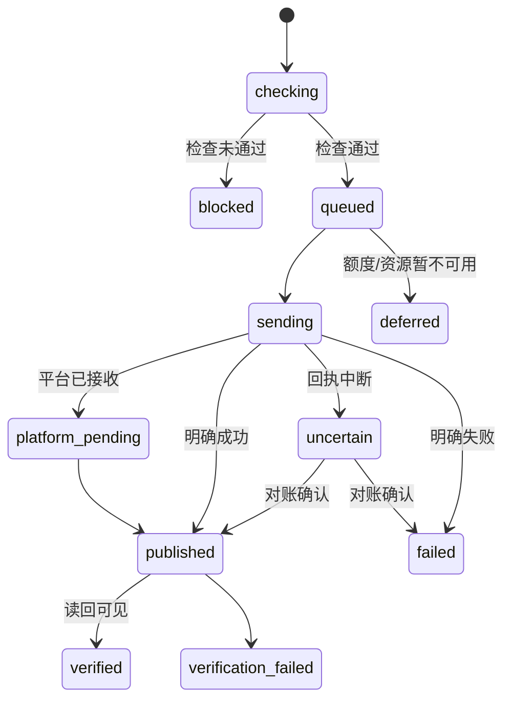

# Memeloop GEO 产品与开发规格书

版本：1.0  
冻结日期：2026-09-18  
状态：实施基线。本文档入库后冻结，后续需求、进度和实施记录分别写入 `TODO.md` 与 `WORKLOG.md`，不再修改本文档。

## 1. 产品定义

Memeloop GEO 是独立实现的 GEO（Generative Engine Optimization）平台，为客户提供企业知识治理、问题与基线测量、优化策略、内容生产、渠道发布、发布验证、周期复测和持续优化的完整自动闭环。

产品由模因循环独立运营，同时支持位面张量及未来运营商以 OEM 方式使用。OEM 与主站使用同一套代码和发布版本，以运营商级品牌、域名、套餐、客户与账单隔离实现白标，不维护代码分叉。

交付形态：

- 自助 SaaS：客户使用自有资料、账号、预算和渠道。
- 自动化托管：平台提供行业工作流、模型能力、运行资源和可购买的发布资源。
- 运营服务：运营团队维护行业知识、策略模板和资源池，不进入逐篇审批或正常发布闭环。
- 企业定制：支持 SSO、私有部署、定制连接器、CRM/BI、数据保留和隔离策略。
- OEM：运营商品牌、域名、套餐、客户生命周期、资源目录与结算均独立。

完整闭环：


正常运行中没有人工审批、逐篇确认、员工授权或人工放行节点。自动检查通过则按排期发布；未通过、服务不可用、证据不足或结果不确定时自动阻断、延后或对账。

## 2. 产品原则

1. 独立实现，不依赖或复制参考项目代码；公开项目只用于调研交互和能力边界。
2. 企业知识库是判断品牌事实、禁用内容和内容质量的唯一业务基础，任何自动检查都必须能回溯知识证据。
3. 账号来源只作为可选备注；自建、客户提供、采购或总部资源不产生不同的审批流程。
4. API、浏览器和云手机共享连接器业务契约，但各自保留不同的执行、重试和对账策略。
5. 客户自有账号矩阵与总部可购买资源池同时存在；调度器自动分配账号、运行环境、出口和成本。
6. 每个账号或连接器可绑定独立上游代理或 IP 池；稳定会话优先，不能因验证码、403 或受阻而自动轮换 IP 继续发送。
7. 测量数据由平台自建采集；消费端网页、消费端 APP 和官方 API 代理指标分开存储、计算与展示。
8. 不使用单一“GEO 总分”。所有指标展示平台、观测面、问题版本、有效样本、计划样本、时间与证据。
9. 百次/秒是全平台任务与模拟出口容量目标，不把入队速率宣称为真实第三方平台发布速率。
10. 社区版本采用 AGPL-3.0-only，另提供商业许可；项目方代码必须保有商业再授权权利。

## 3. 组织、身份与隔离

层级为 `Operator → Tenant → Project`：

- `Operator`：模因循环、位面张量或其他 OEM 运营商。
- `Tenant`：客户组织，拥有成员、知识、预算、账号和项目。
- `Project`：一个品牌、产品或市场目标，拥有问题集、计划、内容、渠道和测量。

角色：

- 运营商管理员：管理 OEM 品牌、套餐、客户、资源目录和运营商级用量。
- 租户管理员：管理客户成员、项目、预算、账号与数据策略。
- 项目成员：管理知识、策略、内容与运行配置。
- 只读成员：查看结果、证据和报告。
- 资源运营员：维护总部账号、出口、连接器和容量，不读取客户完整私有知识。

权限由服务端身份推导，不信任前端提交的 `operator_id` 或 `tenant_id`。数据库查询、消息、对象存储键、检索索引、导出与缓存都必须携带运营商和租户范围。PostgreSQL RLS 与应用层授权同时生效。

## 4. 信息架构与路由

客户工作台基准路由：`/app/:tenantId/:projectId`。

| 编号 | 路由 | 页面 |
|---|---|---|
| P01 | `/setup` | 项目创建与首次配置 |
| P02 | `/overview` | 项目总览与闭环状态 |
| P03 | `/knowledge` | 企业知识库 |
| P04 | `/knowledge/sources/:id` | 来源、解析结果与证据 |
| P05 | `/ask` | 企业问答与问题探索 |
| P06 | `/campaigns` | 优化计划列表 |
| P07 | `/campaigns/:id` | 优化计划与动作 |
| P08 | `/content` | 内容资产列表 |
| P09 | `/content/:id` | 内容编辑器、证据和渠道变体 |
| P10 | `/channels` | 渠道账号、资源池和运行状态 |
| P11 | `/channels/connect` | 批量接入与连接配置 |
| P12 | `/publications` | 发布任务、回执与验证 |
| P13 | `/measurement` | 基线与周期测量 |
| P14 | `/reports` | 效果报告与原始证据 |
| P15 | `/billing` | 预算、用量与账本 |
| P16 | `/settings` | 项目设置、规则和成员 |

总部资源工作台 `/ops`：

- 客户与项目观察。
- 账号、账号池、执行池与出口池。
- 渠道服务目录、容量、成本与排期。
- 连接器版本、健康和运行时。
- 业务用量、结算与根因聚合告警。

OEM 工作台 `/operator`：

- 品牌、域名、主题和通知模板。
- 客户、套餐、订阅、资源目录和账单。
- 成员与运营商级设置。

## 5. 前端设计系统

技术栈：

- TypeScript、React、Vite。
- Fluent UI React v9。
- React Router。
- TanStack Query。
- ECharts。
- Tiptap/ProseMirror JSON 作为内容编辑格式。

布局基线：

- 设计画布 1440×960，完整桌面体验最低宽度 1280。
- 顶栏 56px，展开侧栏 224px，折叠侧栏 64px，内容区间距 24px。
- 8px 间距体系；页面标题 24px，区块标题 18px，正文 14px。
- 列表常规行高 44px，紧凑行高 36px，详情抽屉默认 420px。
- 小于 1100px 时三栏改两栏，小于 768px 时单栏并折叠导航。

Fluent 组件约定：

- `DataGrid` 展示账号、任务、样本和账本。
- `Toolbar` 提供筛选、批量操作和视图切换。
- `Drawer` 展示详情、证据、事件和配置。
- `Dialog` 只用于启动成本确认、暂停后续执行和撤回等高影响操作。
- `MessageBar` 展示持续异常；`Toast` 只反馈短暂成功或失败。
- 状态必须同时使用文字和图标，不只依赖颜色。
- 11 步闭环进度使用可横向滚动的自定义组件，不假设 Fluent 自带 Wizard。

全局交互：

- 筛选和分页写入 URL。
- 服务端分页默认 50 条。
- 后台进度通过可恢复 SSE 提供；断线后按事件游标继续。
- 编辑采用版本号和乐观并发，冲突时展示差异，不静默覆盖。
- 每页必须覆盖空、加载、后台运行、部分成功、失败、需要重连、已阻断、结果待确认、样本不足和无权限状态。

## 6. P01–P02：创建与项目总览

### 6.1 P01 项目创建

四步配置：

1. 品牌与来源：品牌名、官网、文件、网页、FAQ、产品资料。
2. 市场与目标：产品、市场、语言、目标用户、可选竞品（最多 5 个）。
3. 资源与预算：客户自有、总部资源或混合；月度预算；默认保留 20% 用于测量，可编辑。
4. 检查并启动：显示预计导入、问题、测量、生成和发布任务量。

品牌与至少一个知识来源是必填项。上传后立即在后台解析，用户可继续配置。文件初始限制为单文件 100MB、单批 100 个，均为可配置值。

主按钮为“保存并启动”。启动后不再要求逐篇确认。

### 6.2 P02 项目总览

首屏回答四个问题：目前怎样、系统正在做什么、为什么停下、花了多少。

```text
┌ 项目 / 市场 / 观察期              预算余额   运行状态   [启动自动优化] ┐
├ 闭环进度：知识 → 问题 → 基线 → 策略 → 内容 → 检查 → 调度 → 发布 → 验证 → 复测 ┤
├ 已发布资产  被引用资产  有效/计划样本  本期成本  直接线索                ┤
├ 分平台趋势与观测面                  │ 当前机会与建议动作              ┤
├ 最近运行、阻断与待确认结果          │ 根因聚合、预算与资源状态        ┤
└ 点击任意步骤或指标打开带筛选的详情页/抽屉                              ┘
```

基线尚未完成时显示“正在建立基线”，不显示虚假 0 值。暂停只阻止新的外部请求；在途请求可继续完成并产生费用。

## 7. P03–P05：企业知识库

### 7.1 数据链路

`KnowledgeSource → ImportRun → DocumentVersion → Chunk → Entity/FactVersion/FAQ → Evidence → ServingIndex`

来源类型：

- 文件：PDF、DOCX、XLSX、PPTX、Markdown、HTML、纯文本。
- 网页：单页、站点、站点地图、RSS。
- 结构化输入：产品、门店、价格、规格、FAQ、联系人和客户自定义表。
- 内部资料和公开营销资料必须明确区分用途。

首版同域网页导入默认上限 200 页，后续每日增量同步。内容哈希用于去重，解析失败保留逐项结果并支持部分重试。

### 7.2 知识工作台

```text
┌ 来源列表/知识集合 ┬ 文档或事实详情                   ┬ 证据与使用情况     ┐
│ 状态、更新时间    │ 原文预览 / 实体 / 事实 / FAQ     │ 页码、段落、坐标   │
│ 导入、同步、替换  │ 冲突、有效期、语言、市场         │ 被哪些内容与问题使用│
└──────────────────┴──────────────────────────────────┴──────────────────┘
```

定位规则：

- PDF：页码与坐标。
- DOCX/PPTX：标题、段落或幻灯片。
- XLSX：工作表、行、列。
- 网页：URL、抓取时间、正文选择器和快照。

事实字段：

`entity, subject, property, value, unit, market, language, currency, valid_from, valid_to, source, evidence, status, pinned`

自动抽取的事实标记为“可用”，不能标记为“已验证”。冲突处理优先级为：人工固定事实、明确生效日期、当前来源版本；无法判定时保留冲突并阻断依赖内容。

新索引必须原子发布；失败时继续提供旧索引。删除或改为内部资料后，未发布内容的检查结论失效，已发布内容生成修订动作。

### 7.3 检索

- PostgreSQL 全文检索、中文应用层分词与 pgvector 混合召回。
- 权限与公开/内部用途过滤必须在召回前执行。
- 单次生成默认最多引用 12 个证据片段。
- 问答和内容生成都保存证据链接。

P05 问答可以将结果转为 `ContentBrief`，但只传递选定证据和摘要，不把整个对话无边界注入生成流程。

空状态文案：“还没有企业知识。导入产品资料、官网内容或常见问题，系统将提取可追溯事实。”按钮：“导入资料”。

## 8. P06–P07：优化计划

核心实体：

- `StrategyVersion`
- `OptimizationPlan`
- `PlanAction`
- `Experiment`
- `OptimizationCycle`
- `ContentBrief`

创建计划必填：目标产品、市场、语言、周期和预算。系统从知识库、现有问题、销售反馈和模型生成候选问题；问题集版本化，80% 用于策略，20% 冻结为评估集。

机会类型：

- 目标问题未提及品牌。
- 提及但未引用目标资产。
- 事实错误或过期。
- 竞品占据可解释推荐位置。
- 缺少可引用页面或结构化事实。
- 已有内容存在抓取、索引或转换障碍。

排序依据为业务权重、差距、可行动性和预计成本，不展示无法验证的“预测 ROI”。

计划页：

```text
┌ 计划状态 / 周期 / 预算 / 观测面                                  ┐
├ 机会与问题列表                  │ 基线证据、事实和推荐动作          ┤
│ 意图、平台、差距、样本          │ ContentBrief、成本、窗口、渠道   │
├ 动作时间线、实验组/保留组、终止条件和实际结果                      ┤
└ [启动本轮] [暂停后续执行] [查看成本]                               ┘
```

计划修改只影响尚未开始的动作；已经进入发送中的任务不被隐式取消。

## 9. P08–P09：内容资产

支持内容类型：

- FAQ、产品页、场景页、How-to。
- 带来源的比较、事实更新和解释文章。
- 渠道短文、社交帖子和站点摘要。
- 结构化数据与托管站点页面。

版本链：

`ContentBrief → MasterContentVersion → ChannelVariant → PublicationInstance`

编辑器：

```text
┌ 大纲与章节 ┬ 主编辑区                              ┬ 证据与自动检查     ┐
│ 内容结构    │ 标题、正文、媒体、结构化字段          │ 事实来源、冲突、缺失│
│ 渠道变体    │ 自动保存、版本差异、预览              │ 渠道要求、修复记录  │
└────────────┴──────────────────────────────────────┴────────────────────┘
```

- 1 秒无操作自动保存草稿。
- 人工编辑会使既有自动检查结果失效。
- 自动检查输出原因和证据，不输出单一质量分数。
- 可自动修复格式或表达问题，最多两轮；每轮产生新版本并重新检查。
- 关键事实缺失、事实冲突和账号不可用不能通过改写绕过。
- 生成图片、图表和信息图优先表达真实事实，不生成冒充产品实拍的素材。

## 10. P10–P11：账号、资源池和网络

### 10.1 三类资源池

1. 账号池 `AccountPool`：按运营商、渠道、用途、行业、语言、地区和容量组织账号。
2. 执行池 `ExecutionPool`：API Runner、浏览器会话和云手机设备的并发与租约。
3. 出口池 `EgressPool`：独享 IP、共享 IP、地区、协议、健康、成本和账号会话粘性。

账号来源：

- 客户自有账号。
- 平台运营账号。
- 渠道供应商资源。

来源和采购成本只作为可选备注，不改变接入与发布流程。

### 10.2 接入流程

`选择渠道 → 选择默认执行环境/出口 → 登录或导入 → 识别账号 → 建立会话 → 加入账号池`

批量导入支持 CSV、XLSX、JSON 和粘贴表格：

1. 上传或粘贴。
2. 映射字段。
3. 校验和脱敏预览。
4. 导入。
5. 展示逐项结果并允许下载错误清单。

不接受任意未知格式 Cookie；每个连接器定义可导入字段。重复账号默认跳过，用户可显式选择替换会话。

账号不可用时：

- 暂停该账号的新任务。
- 未发送任务可重新分配。
- 发送结果不确定的任务进入对账，不能直接换账号重发。
- 根因相同的异常聚合通知，避免逐条告警。

### 10.3 出口优先级

`账号网络策略 > 连接器网络策略 > 运营商默认网络策略`

- 默认维持账号与出口的稳定绑定。
- 仅在请求明确尚未发送、同地区、同策略的出口故障时允许切换。
- 验证实际公网 IP、DNS 和 WebRTC 泄漏；配置字段不等于生效证据。
- 浏览器上传、回调和云手机实际应用流量都必须走指定出口。

### 10.4 统一连接器

业务接口：

```text
capabilities()
preflight(context)
execute(operation, session, execution_lease, network_lease, payload, idempotency_key)
reconcile(attempt)
read_back(external_id)
update(external_id, payload)
withdraw(external_id)
health()
```

共享的是请求、回执、证据与状态契约，不强行共享重试算法。

- API Runner：Rust HTTP 客户端，优先官方接口。
- Browser Runner：自托管 Chromium/CDP，确定性步骤和版本化页面适配器。
- Mobile Runner：通过 `DeviceProvider` 调用云手机控制面和 Appium。

云手机抽象：

`lease/start/stop/install/open/snapshot/execute/network_evidence/cost/release`

首版完成契约和模拟器；供应商通过真实 PoC 后才标记为可用。

## 11. P12：发布、验证与对账

发布模型：

`PlacementRequest → AccountAssignment → PublicationIntent → PublicationAttempt → Receipt → Verification`

- `PlacementRequest` 表示内容、渠道、账号池、地区、截止时间和预算约束。
- 调度器生成 `AccountAssignment`，冻结账号、执行池和出口。
- `PublicationIntent` 是一次逻辑发布，不因重试产生新订单。
- `PublicationAttempt` 记录每次真实外部尝试。

状态：



“已发布”与“已验证”严格区分。`uncertain` 只做对账；只有明确未发送的失败才能在同一逻辑意图中受控重试。

标准状态文案：

- 检查中、检查通过、已排期、发送中、平台处理中、已发布、已验证。
- 已阻断、已延后、结果待确认、失败、验证失败、已过期、已取消。

关键文案：

- 结果待确认：“平台响应中断，暂无法确认是否发布。系统正在对账，不会直接重复发送。”
- 平台处理中：“平台已接收，正在处理；尚未确认公开可见。”
- 验证失败：“已收到发布回执，但尚未验证页面可见性。”

## 12. P13–P14：测量、报告和线索

### 12.1 观测面

- `consumer_web`：真实消费端网页新会话。
- `consumer_app`：真实 APP 新会话。
- `api_search`：官方模型或搜索 API 的代理指标。

三种观测面不混算。固定基准禁止静默切换模型或提供方。

### 12.2 测量协议

`BenchmarkVersion` 固定问题、意图、语言、地区、品牌别名、竞品集合、采样次数、会话模式、入口和权重。

初始默认：

- 每项目 100 个问题。
- 每题、每平台、每轮 5 次跨时段采样。
- 双周全量复测，日常使用少量哨兵题。
- 80% 优化集，20% 冻结评估集。

保存：

- 原始问题和答案。
- 引用 URL 与可定位片段。
- 采集时间、地区、入口、会话模式。
- 可见模型标识、连接器版本和匿名账号队列标识。
- 截图或结构化证据。

验证码、技术缺测、拒答、空答案、未联网和无品牌提及分别记录。缺测显示“—”，不能当作 0。

指标：

- 提及率 = 含目标品牌的有效答案数 / 有效答案数。
- 引用率 = 引用目标资产 URL 的有效答案数 / 有效答案数。
- 推荐率只统计明确推荐。
- 首位/前三只用于存在可解释排序的答案。
- SOV = 目标品牌出现次数 / 登记品牌集合出现次数总和；每品牌每答案最多一次，分母为 0 时显示不适用。

报告按平台、观测面、语言、地区、问题版本和周期分段，展示有效/计划样本、缺测、变化和原始证据。历史报告使用不可变快照。

### 12.3 自建测量执行

- 浏览器在服务端无头环境中创建新会话，输入原始问题，等待完成并采集答案、引用和截图。
- API 测量通过 Token Center 或官方接口适配器执行，但单独标记为 `api_search`。
- 云手机测量使用 `DeviceProvider` 与 Appium，并验证真实应用流量出口。
- 测量 Worker 与生产内容 Worker 权限隔离，不向消费端注入客户私有知识。

### 12.4 站点与转化

站点审计识别抓取、结构、内容和证据缺口。受支持 CMS 可在既定范围内自动修复；不支持的站点生成补丁包。

托管站点提供可读 HTML、FAQ、产品、案例和线索表单。线索以列表与签名 webhook 输出；直接引荐、自报来源和推测影响分开统计，不从访问量推断收入。

## 13. 后端架构与数据契约

### 13.1 技术栈

- Rust 1.96+、Axum、Tokio、SQLx。
- PostgreSQL 作为业务真相、状态、账本、租约和事务 outbox。
- NATS JetStream 作为持久消息与消费者通知。
- Redis 用于共享频控、短期容量租约和缓存，不保存唯一业务真相。
- S3 兼容对象存储保存原始证据、内容快照和回执。
- Apache Tika/Tesseract 通过隔离的解析适配服务接入。

采用模块化单体、多个角色部署。每个领域模块拥有自己的聚合写权限，其他模块通过命令或事件协作。

### 13.2 Rust 工作区模块

| 模块 | 拥有的实体 |
|---|---|
| `identity_tenancy` | Operator、Tenant、Member、RoleBinding、Project |
| `knowledge` | KnowledgeSource、ImportRun、DocumentVersion、FactVersion、Evidence、FactConflict |
| `benchmark` | QuestionSet、BenchmarkVersion、Question、EvaluationSplit |
| `measurement` | MeasurementPlan、MeasurementRun、Sample、Observation、Citation、MetricSnapshot |
| `strategy` | StrategyVersion、OptimizationPlan、PlanAction、Experiment、OptimizationCycle |
| `content` | ContentAsset、ContentVersion、ClaimEvidenceLink、ChannelVariant |
| `policy` | PolicyVersion、CheckRun、CheckFinding、ReleaseDecision；不存在 Approval |
| `accounts` | ConnectionBatch、ConnectionItem、ChannelAccount、CredentialRef、AccountPool、AccountScope |
| `resources` | ExecutionPool、EgressPool、EgressEndpoint、ResourceLease、AccountSessionBinding、DeviceLease |
| `publication` | PlacementRequest、AccountAssignment、PublicationIntent、PublicationAttempt、Receipt、Verification、Withdrawal |
| `scheduler` | Schedule、QuotaPolicy、QuotaReservation、DispatchLease、KillSwitch |
| `connectors` | ConnectorDefinition、CapabilitySnapshot、ConnectorVersion |
| `commerce` | Plan、Subscription、PublicationOffer、Order、BudgetReservation、LedgerEntry、Settlement |
| `workflow` | WorkflowDefinition、WorkflowRun、StepRun、ScheduledTrigger、OutboxEvent、InboxRecord |
| `token_center_adapter` | 模型凭据映射、请求标识和模型用量同步 |
| `api/workers/migrations` | HTTP、后台角色和数据库迁移 |

### 13.3 REST API

统一 `/api/v1`，OpenAPI 生成 TypeScript 客户端。异步操作返回 `202 + operation_id`。

最小资源：

- `/projects`
- `/projects/{id}/knowledge-imports`
- `/knowledge-imports/{id}/items`
- `/projects/{id}/facts`
- `/projects/{id}/benchmark-versions`
- `/measurement-runs`
- `/projects/{id}/optimization-plans`
- `/optimization-plans/{id}/actions`
- `/content-generation-runs`
- `/content-assets/{id}/versions`
- `/content-versions/{id}/check-runs`
- `/account-connection-batches`
- `/account-pools`
- `/egress-pools`
- `/egress-endpoints`
- `/channel-accounts/{id}/network-policy`
- `/resource-pools/{id}/capacity`
- `/publication-batches`
- `/publication-intents/{id}`
- `/publication-intents/{id}/attempts`
- `/publication-intents/{id}/evidence`
- `/projects/{id}/optimization-schedules`
- `/projects/{id}/optimization-cycles`
- `/operations/{id}`
- `/events`（SSE）
- `/usage`
- `/ledger-entries`
- `/operators/{id}/branding`
- `/offers`
- `/subscriptions`

不存在 `/approve`、`/manual-release` 或员工授权接口。

幂等规则：

- 所有产生外部副作用的请求要求 `Idempotency-Key`。
- 幂等键与请求体哈希绑定，同键不同内容返回冲突。
- 批量项携带稳定 `client_item_id` 并独立返回结果。
- 乐观更新使用 `revision` 或 `If-Match`。

### 13.4 事件

事件信封：

`event_id, event_type, schema_version, operator_id, tenant_id, project_id, aggregate_id, aggregate_version, occurred_at, correlation_id, causation_id, payload_ref`

主链：

`knowledge.imported → facts.versioned → benchmark.frozen → measurement.completed → strategy.created → content.versioned → checks.passed → placement.requested → account.assigned → publication.scheduled → publication.dispatched → publication.accepted → publication.verified → measurement.due → measurement.completed → optimization.cycle.completed`

异常：

`checks.blocked / account.paused / credentials.expired / resource.lease_lost / publication.uncertain / publication.failed / publication.expired / budget.exhausted / kill_switch.activated`

账务：

`cost.reserved / cost.observed / cost.settled / reservation.released`

## 14. 可靠性、吞吐与部署

### 14.1 可靠性

- 业务状态与 outbox 在同一 PostgreSQL 事务写入。
- 消息至少一次投递，消费者用事件 ID 和聚合版本去重。
- 外部调用前记录 attempt；超时或崩溃后先对账。
- 租约使用 fencing token，但失效租约不能撤回已发出的网络请求。
- Redis 故障时发布失败关闭；恢复后根据持久记录保守重建配额。
- 429 按响应头延后；401/403 暂停账号；网络超时进入对账，不假设未发布。
- 平台、应用、物理账号、资源供应方、运营商、租户和项目分别限流。
- 全局、运营商、租户、平台和账号都提供 kill switch。

### 14.2 容量目标

模拟环境验收：

- 300 个单目标发布意图/秒，持续 60 分钟。
- 1000 个意图/秒突发 60 秒。
- 在明确硬件和任务体积下，持久化入队 p95 ≤ 500ms。
- 模拟出口具备容量时，持续完成至少 100 次发布/秒。

分别统计接收、持久化、检查完成、外部发送和验证成功速率。

热数据按时间和租户分区；outbox/inbox、attempt、事件和原始证据配置独立保留与归档。队列有容量和截止时间；被平台限额阻塞的任务不触发无限扩容。

### 14.3 部署

- 公网流量通过 Higress，服务使用 ClusterIP。
- GEO 使用独立 PostgreSQL/Redis/NATS/S3 资源或明确隔离的专用实例，不复用 Analytics 专用 Redis。
- API、工作流、浏览器执行、移动执行和测量执行采用独立 Deployment 与网络策略。
- Prometheus/Grafana/Loki 接入现有可观测体系。
- 密钥通过 External Secrets 注入，不进入前端、日志或消息。
- Token Center 只提供模型凭据、路由和用量能力；GEO 自己拥有身份、订阅、任务预算、渠道费用和业务账本。

## 15. 商业、OEM 与许可

客户账本区分：

- 订阅收入。
- 模型成本。
- 测量成本。
- 渠道 API 成本。
- 浏览器/云手机运行成本。
- 总部发布资源费用。
- OEM 应收应付。

首版使用内部余额和企业账期账本，支付渠道通过适配器接入，不把未验证的支付系统写成现成功能。

总部资源目录展示渠道、行业、语言、地区、容量、价格版本和执行窗口。客户购买的是服务额度，不获得账号密码或 Cookie。调度和结算自动完成。

OEM 隔离内容：

- 域名、SSL、Logo、主题、文案和邮件模板。
- 套餐、服务目录、客户、订阅和账单。
- 客户数据与对象存储。
- 支持入口与通知。

许可证采用 AGPL-3.0-only + 商业许可双轨。第三方依赖逐项核验；外部贡献需使用允许商业再授权的 CLA。

## 16. 实施工作包与验收

### 16.1 工作包

| 工作包 | 内容 | 依赖 |
|---|---|---|
| W01 | Monorepo、React/Fluent 壳、Rust API、OpenAPI、测试与 CI | 无 |
| W02 | Operator/Tenant/Project、P01 设置、P02 总览 | W01 |
| W03 | 知识导入、版本、证据、检索与 P03–P05 | W02 |
| W04 | 问题集、基线测量、原始样本与指标 | W03 |
| W05 | 策略、计划、动作、实验与周期状态 | W04 |
| W06 | 内容资产、编辑器、证据绑定和自动检查 | W03、W05 |
| W07 | 账号批量接入、三类资源池、出口策略 | W02 |
| W08 | 调度、发布、对账、验证和第一批连接器 | W06、W07 |
| W09 | 周期测量、报告、站点审计、托管页和线索 | W04、W08 |
| W10 | 用量、账本、资源目录、订阅和 OEM | W02、W07 |
| W11 | 容量、故障注入、恢复、监控、备份与安全 | W01–W10 |
| W12 | 云手机供应商、Appium、APP-only 渠道 | W07、W08、真实 PoC |

每个工作包必须同时交付页面、API、状态处理、自动化测试和演示数据，不能只完成界面或单个成功 API。

### 16.2 首个完整纵切

首个纵切采用一个实际 WordPress 或 Ghost 出口和一个明确标记为 `api_search` 的实际测量出口。浏览器与云手机先通过统一契约模拟测试，不宣称真实可用。

验收：

1. 两个运营商、各一个租户，API、SSE、队列、对象存储和导出互不可见。
2. 导入企业资料，生成可定位事实版本和问题集版本。
3. 完成基线测量并保留原始证据。
4. 自动生成计划、动作、内容版本并通过自动检查。
5. 批量接入账号，建立客户账号池和总部资源池。
6. 配置独享出口和共享出口，并取得实际公网出口证据。
7. 两种账号路径都能自动分配、发布、回读和验证，全程没有审批按钮。
8. 周期测量产生下一轮动作或按预设终止条件结束。
9. 重复消息、Worker 崩溃、回执丢失、凭据失效、预算不足和出口租约丢失均不导致重复发布、重复扣款或跨租户接管。
10. React/Fluent UI 能完整查看知识、基线、策略、内容、检查、资源、回执、复测和成本。

### 16.3 端到端场景

- 导入知识 → 建立问题集 → 基线 → 计划。
- 替换知识来源 → 事实新版本 → 未发布内容重新检查 → 已发布内容产生修订动作。
- 批量导入账号 → 绑定出口 → 加入账号池 → 自动发布。
- 无自有账号 → 购买总部资源 → 自动分配和结算。
- 外部超时 → 结果待确认 → 对账确认，不重复发送。
- 测量原始答案 → 指标证据 → 内容动作 → 下一轮计划。
- 订阅到期后停止新付费任务，历史数据只读可见。
- OEM 品牌、客户、资源和账单隔离。

### 16.4 完成定义

功能只有在以下条件全部满足时才完成：

- 页面包含真实数据、完整状态、权限、响应式和键盘操作。
- API 有 OpenAPI 契约、鉴权、幂等、错误码、迁移和测试。
- 后台流程可恢复、可对账、可观察，不依赖进程内存。
- 自动检查与知识证据绑定，事实更新会传播失效。
- 测量观测面、缺测和样本分母正确。
- 外部副作用不会因重试、崩溃或超时重复发生。
- 成本预留、实际费用和结算可核对。
- 跨运营商、跨租户和资源供应方权限测试通过。
- 使用本地模拟渠道完成容量与故障验收，第三方平台不进行未授权压测。
